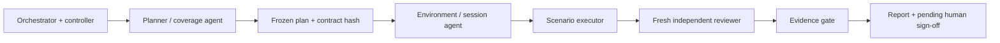

# Release QA swarm controller

This package separates Cursor's real native child-agent dispatch from deterministic handoff and evidence validation. Agents decide release-specific QA work. The controller fixes the role order and contracts; the gate prevents malformed or incomplete evidence from becoming a supported verdict.

Roles are real separate Cursor children with tool-returned identities. One active child is the initial supported concurrency limit; a swarm does not require all agents to run simultaneously. Shared server settings remain serialized. No recursive agent spawning is permitted.

## Source of authority

- [orchestrator.md](orchestrator.md): selection, sequencing, scope and reporting policy.
- [planner.md](planner.md): requirements, existing unit/API/E2E evidence and missing user journeys.
- [environment.md](environment.md): cold startup, release/license identity and checked sessions.
- [executor.md](executor.md): typed observations, settled UI, real actions and preserved attempts.
- [reviewer.md](reviewer.md): complete independent review, including actual images and predicates.
- [Controller](../../../scripts/release-qa-swarm.mjs): append-only local handoff records, exact prompt bytes, real receipt references and separate role IDs.
- [Gate](../../../scripts/release-qa-swarm-gate.mjs): frozen-plan bindings, evidence hashes, typed API values, readiness, identity and reviewed assertion accounting.

The automation must fetch these files at a pinned **controller source revision**, verify the published hashes, and run that code. This pin is deliberately stable workflow code; the release under test, scenario IDs, settings, selectors, identities and expected outcomes are run data chosen from the input and release evidence. There is no remembered current release or permanent Hardened Mode scenario.

## Native bridge

The Node controller cannot call Cursor's internal native agent tools directly. The orchestrator is the bridge: discover the actual tool/schema, capture that inventory, obtain `next`, dispatch its exact prompt through the native tool, save the actual returned receipt, wait for completion, and record it. A native tool returning no usable identity cannot satisfy the contract. Role labels, fabricated receipts, same-agent roleplay and shell-based model calls are not substitutes.

The controller hashes prompt/contract snapshots before dispatch. The executor cannot provide a weaker reviewer prompt. The independently launched reviewer receives the canonical contract plus structured artifact references. Every subsequent controller operation rechecks the stored artifact hashes and event chain. A changed plan or contract cannot silently proceed.

Actual future worker IDs are not inserted into the frozen plan. Assertions refer to logical executor slots; later tool-returned IDs are stored in the separate assignments manifest. This avoids both fabricated identities and changing a plan after execution.

The implementation rejects malformed handoffs and empty-work success, but does not claim sandbox enforcement against an agent that deliberately bypasses the tools. Native receipt text captured in a shared writable filesystem is not independently authenticated provenance. File hashes cannot prove an image shows a usable application; the reviewer must inspect it. Those limits remain in every gate output.

## Runtime modes and budgets

`plan-and-execute` performs native planner → environment → executor → reviewer handoffs. `plan-only` resolves and plans without server startup or release qualification. `execute-plan` validates an accessible supplied frozen plan. `audit-existing` reviews a supplied historical artifact bundle; it must never relabel old execution as a new product test. Harness evaluations are explicitly HARNESS_ONLY.

Every disposable execution brings up its own server/database and prepares the selected candidate's E2E session pattern. A cache miss is normal setup. Reserve startup, review and cleanup budgets. The controller enforces issuance deadlines and one active job; native process cancellation and actual token/dollar metering depend on the bridge and must not be represented as implemented if unavailable.

Release qualification is distinct from gate success. `PASS` validates only the declared evidence contract and scope; it is not `GO` for a whole release. Missing/contradictory evidence is `BLOCKED`, while a supported product mismatch can be `FAIL`. Evidence audit uses exactly ACCEPTED, REJECTED or INCOMPLETE. Human sign-off stays PENDING.

## Validation and publication

Focused controller and gate tests exercise native handoff order, prompt changes, reused role identities, missing or altered artifacts, typed values, readiness, optional evidence and independent-review completeness. Synthetic test inputs are controller tests, not Mattermost results. Live Cursor validation must separately show actual native role IDs and rejection of the prior loader-screen evidence before claiming the bridge works.

This is a lean first controller, not an unattended release service. Recurring triggers, durable cross-host state, independently controlled evidence custody, cancellation beyond bridge support and broad release qualification remain explicit deployment responsibilities.
